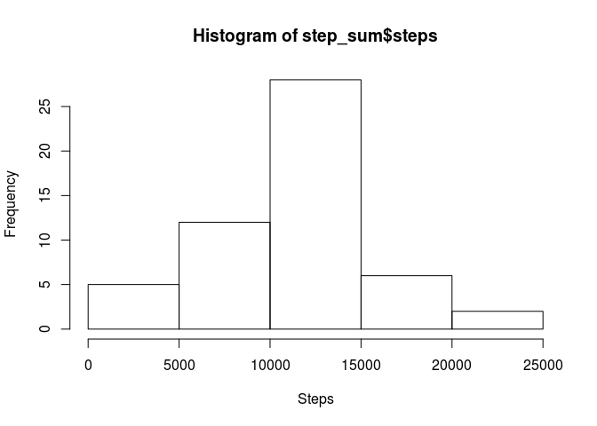
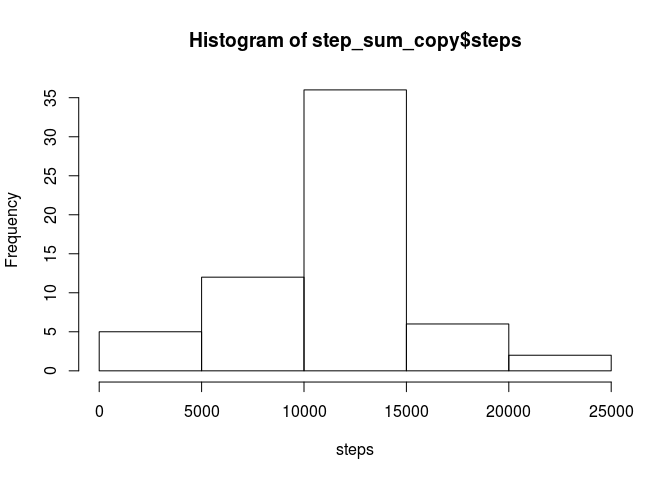
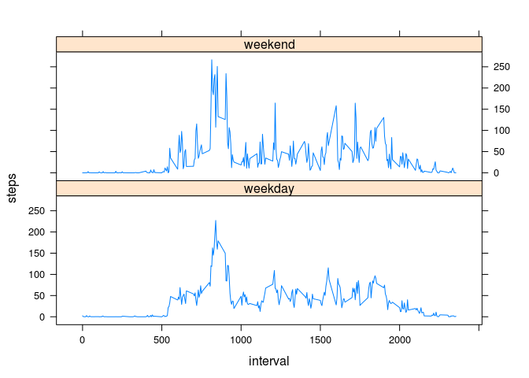

# Reproducible Research: Peer Assessment 1


## Loading and preprocessing the data

```r
options(scipen=999)
data <- read.csv("activity.csv")
step_sum <- aggregate(steps~date, data=data, FUN="sum")
step_avg_by_int <- aggregate(steps~interval, data=data, FUN="mean")
```


## What is mean total number of steps taken per day?

```r
steps_mean <- round(mean(step_sum$steps))
steps_median <- median(step_sum$steps)
hist(step_sum$steps, xlab = "Steps")
```

 

The mean steps per day is 10766. and the median is 10765  

## What is the average daily activity pattern?

```r
max_step_by_int <- max(step_avg_by_int$steps)
max_step_int <- step_avg_by_int[step_avg_by_int$steps==max_step_by_int,]$interval
max_step_int <- paste0(sprintf("%02d", max_step_int %/% 100), ":", sprintf("%02d", max_step_int %%100))
step_avg_by_int$interval <- as.character(step_avg_by_int$interval)
plot(step_avg_by_int, type = "l")
```

 

The 08:35 5 minute interval, on average across all the days in the dataset, contains the maximum number of steps (206.1698113).  

## Imputing missing values

```r
num_missing <- sum(is.na(data$steps))
data_copy <- data
for (i in 1:nrow(data_copy)) {
  if(is.na(data_copy$steps[i])) {
    data_copy$steps[i] <- step_avg_by_int[step_avg_by_int$interval == data_copy$interval[i],]$steps
  }
}
step_sum_copy <- aggregate(steps~date, data=data_copy, FUN="sum")
hist(step_sum_copy$steps, xlab = "steps")
```

 

```r
steps_mean_copy <- mean(step_sum_copy$steps)
steps_median_copy <- median(step_sum_copy$steps)
```

The mean steps per day after imputing missing values with the average 5 min interval is 10766.1886792. and the median is 10766.1886792.  
The values have very little change from the original mean and median, but seem to have converged to the same value.  

## Are there differences in activity patterns between weekdays and weekends?

```r
library(chron)
library(lattice)
first_day <- as.Date(data_copy$date[1])
day_end <- logical()
for(i in 0:60) {
  day_end <- c(day_end, as.integer(rep(is.weekend(first_day + i)), 288))
}
day_end <- factor(day_end, labels = c("weekday","weekend"))
data_copy <- cbind(data_copy, day_end)
mean_steps_by_week_interval <- aggregate(steps ~ day_end + interval, data=data_copy, FUN="mean")
xyplot(steps~interval | day_end, data=mean_steps_by_week_interval, type='l', layout=c(1,2))
```

 
